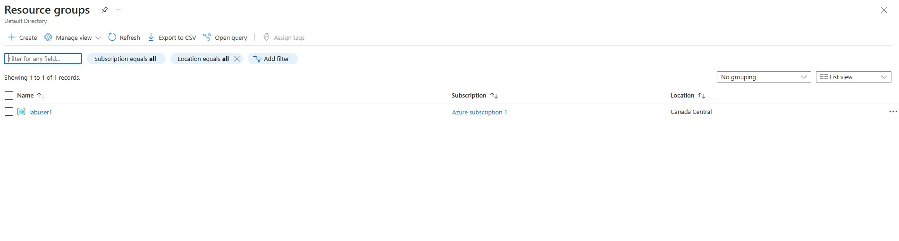
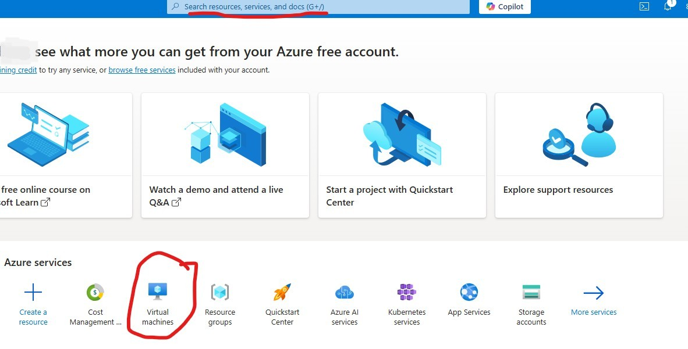
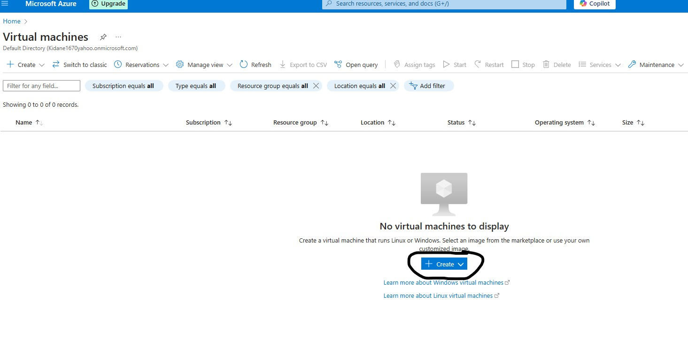

<h1>Virtual Machine - Creation tutorial</h1>
In this tutorial, I will demonstrate how to create a virtual machine in Microsoft Azure and connect to it using Remote Desktop. But before we start we need a Microsoft Azure account. If you don’t already have one, visit https://azure.microsoft.com/free/ and create a free account by clicking the 'Try Azure for Free' button. New users receive $200 in Azure credits to explore and use Azure services during the trial period.
 

<!-- <h2>Video Demonstration</h2>

 - ### [YouTube: How To Install osTicket with Prerequisites](https://www.youtube.com) -->

<h2>Environments and Technologies Used</h2>

- Microsoft Azure 
- Remote Desktop
- Virtual Machine

<h2>Operating Systems Used </h2>

- Windows 10 PRO</b>
- Windows Pro, Version 22H2</b>

<!-- <h2>List of Prerequisites</h2>

- Web Server
- Item 2
- Item 3
- Item 4
- Item 5

"C:\Users\esrom\iCloudDrive\Desktop\GITHUB PORJECT\Profile\Insatall osTicket.png"
-->

<h2>Creating Steps</h2>

<h3>Resource Group</h3>
 

Before creating the VM, we first need to create a Resource Group. A Resource Group is a container that holds Azure related resources and helps keep them organized. You can think of a Resource Group as similar to a File Explorer it keeps things organized and easily accessible.

  

  
To begin the creation process, click the blue "Create" button located prominently in the center of the screen.
  

Creating Resource Group
    
Next, provide a name for the Resource Group and select a region to locate the physical data center of the Resource Group. Once completed  click the 'Review + Create' button located in the bottom left corner to proceed with the validation process.
  

RG Validation Passed
   
After entering all the required information, the system will validate. If everything is correct a green checkmark will appear, indicating successful validation. But if there are any issues, it will ask to be reviewed and corrected in order to proceed. Once the green checkmark appears, click the 'Create' button located in the bottom left corner to finalize the creation. 
  

<h3>RG-Created</h3>  
The Resource Group has been created, and it can be located by typing 'Resource Group' into the search bar at the top-middle of the screen 
 or you can navigate to it by clicking the 'Resource Group' option under the Azure Services section, located in the middle portion of the page. 

<!--

Before creating the VM, we first need to create a Resource Group. A Resource Group is a container that holds Azure related resources and helps keep them organized. You can think of a Resource Group as similar to a File Explorer it keeps things organized and easily accessible.

-->
 

 <h3>Virtual Machine</h3>
 
   
Now that the Resource Group is set up, let's proceed to create the virtual machine (VM). To start type 'Virtual Machine' into the search bar at the top-middle of the screen or click the 'Virtual Machine' option under the Azure Services. Then it'll prompt you this  screen and click the blue 'Create' button in the middle of the screen or use the 'Create' button located in the top-left corner. Then, select the Azure Virtual Machine option to proceed with the VM setup process.
  

Creating Virtual Machine
  
Next, fill out the required fields. Let's begin with the Resource Group, so click the dropdown next to resource group(Red line) and click on the resource Group that was created. Then create the virtual machine name(Orange line) keep it simple and short. Then select a region(light-blue line) doesn't have to be the same as the resource group. Then we'll make our way down and select an image(brown line), click the dropdown and select 'Windows 10 Pro(free service eligible)'

  

  

 After successfully creating the Resource Group, we will proceed to create the Virtual Machine and associate it with the newly created Resource Group. By placing the Virtual Machine within this Resource Group, it becomes easier to manage and monitor, allowing for better oversight and efficient tracking of dependencies and costs.

 

 

 
