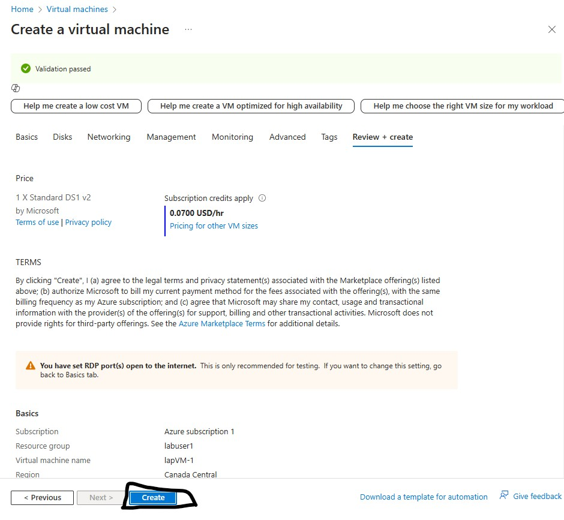

0

<h1>Virtual Machine - Creation tutorial</h1>
In this tutorial, I will demonstrate how to create a virtual machine in Microsoft Azure and connect to it using Remote Desktop. But before we start we need a Microsoft Azure account. If you don’t already have one, visit https://azure.microsoft.com/free/ and create a free account by clicking the 'Try Azure for Free' button. New users receive $200 in Azure credits to explore and use Azure services during the trial period.
 

<!-- <h2>Video Demonstration</h2>

 - ### [YouTube: How To Install osTicket with Prerequisites](https://www.youtube.com) -->

<h2>Environments and Technologies Used</h2>

- Microsoft Azure 
- Remote Desktop
- Virtual Machine

<h2>Operating Systems Used </h2>

- Windows 10 PRO</b>
- Windows Pro, Version 22H2</b>

<!-- <h2>List of Prerequisites</h2>

- Web Server
- Item 2
- Item 3
- Item 4
- Item 5

"C:\Users\esrom\iCloudDrive\Desktop\GITHUB PORJECT\Profile\Insatall osTicket.png"
-->

<h2>Creating Steps</h2>

<h3>Resource Group</h3>
 

Before creating the VM, we first need to create a Resource Group. A Resource Group is a container that holds Azure related resources and helps keep them organized. You can think of a Resource Group as similar to a File Explorer it keeps things organized and easily accessible.

  

  
To begin the creation process, click the blue "Create" button located prominently in the center of the screen.
  

Creating Resource Group
    
Next, provide a name for the Resource Group and select a region to locate the physical data center of the Resource Group. Once completed  click the 'Review + Create' button located at the bottom left corner to proceed with the validation process.
  

RG Validation Passed
   
After entering all the required information, the system will validate. If everything is correct a green checkmark will appear, indicating successful validation. But if there are any issues, it will ask to be reviewed and corrected in order to proceed. Once the green checkmark appears, click the 'Create' button located in the bottom left corner to finalize the creation. 
  

<h3>RG-Created</h3>  
The Resource Group has been created, and it can be located by typing 'Resource Group' into the search bar at the top-middle of the screen 
 or you can navigate to it by clicking the 'Resource Group' option under the Azure Services section, located in the middle portion of the page. 

<!--

Before creating the VM, we first need to create a Resource Group. A Resource Group is a container that holds Azure related resources and helps keep them organized. You can think of a Resource Group as similar to a File Explorer it keeps things organized and easily accessible.

-->
 

 <h3>Virtual Machine</h3>
 
   
Now that the Resource Group is set up, let's proceed to create the virtual machine (VM). To start type 'Virtual Machine' into the search bar at the top-middle of the screen or click the 'Virtual Machine' option under the Azure Services. Then it'll prompt you this  screen and click the blue 'Create' button in the middle of the screen or use the 'Create' button located in the top-left corner. Then, select the Azure Virtual Machine option to proceed with the VM setup process.
  

Creating Virtual Machine
  
Next, fill out the required fields to set up your virtual machine.Begin by selecting the Resource Group: click the dropdown menu next to Resource Group (highlighted in red) and choose the Resource Group previously created. Next create a name for your virtual machine (highlighted in orange). Keep it simple and make it easier to identify(space not allowed). Then select a region for the virtual machine (highlighted in light blue). The region does not need to match the one chosen for the Resource Group. Then we move on to the Image section (highlighted in brown), click the dropdown and select 'Windows 10 Pro(free service eligible)'.
  

Then, we’ll move on to selecting a size for the virtual machine. Click the dropdown menu (highlighted in yellow) and choose the desired size. For better performance, I recommend selecting a version 2 or higher. In this example, I'll go with 'Standard_DS1_v2-1'. After selecting the size, proceed to the Administrator Account section (highlighted in green) to create the login credentials. I strongly recommend writing them down beforehand, as they will be required to log in to the Remote Desktop. Next, scroll down to the licensing section. Check the box (highlighted in purple) to confirm.
 

 

Finally, click the blue 'Review + Create' button located at the bottom of the page to proceed with creating the virtual machine (VM). This will prompt the system to validate all the information entered. If there are no issues, it'll pass the validation and be able to finalize the creation process on the next screen.
  

  

 Once getting to this page, click the 'Create' button (highlighted in black) to finalize the creation of the virtual machine (VM). This will initiate the deployment process.(may take 1-3 min to deploye) Azure will set up the VM according to the configurations we provided. 

 

 After the deployment is complete, click the 'Home' tab located at the top-left corner of the screen to return to the main page. To locate your virtual machine, you can either use the search bar (highlighted in Red) at the top of the page by typing 'Virtual Machine', or navigate to it by clicking the 'Virtual Machine' option under the Azure Services section (highlighted in black).

  

<h2>Connecting to Remote Desktop</h2> 

<h3>Connecting Steps</h3>

To connect, you’ll need the IP address of the Virtual Machine. To retrieve it, click on Virtual Machine, which will bring you to the  page. On this page, you’ll find the IP address displayed on the right side (highlighted in green). Simply copy it and paste it into the Remote Desktop application. Or you can click on the VM name (highlighted in red) to access the detailed overview page, where the IP address can also be found and copied. 

To exit, you can click the 'X' button located at the top of the screen or you can shut down the computer by locating the Start button at the bottom-left corner of the screen. Right-click on it, select 'Run', type 'signoff', and press Enter. 

For Mac users, you can download 'Windows App' from the app store. Once the downloaded open the app and click the '+' button   then select 'Add PC'. In the PC Name field, enter the IP address of the virtual machine. If you'd like, you can also provide a custom identifier by typing any desired name in the Friendly Name field, then click add. To connect, double-click on the small screen next to the IP address or the name you may've given it, and a login prompt will appear. Enter the credentials for your virtual machine. Finally, you’ll gain access to the virtual machine.
